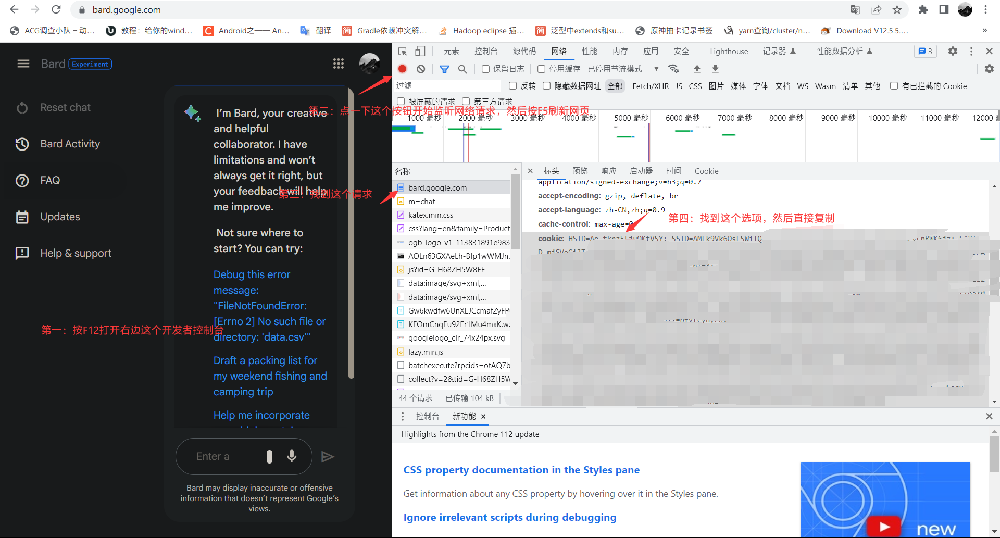

## koishi-plugin-chathub-bard-adapter

##  

> 为chathub提供Bard支持的适配器

## 怎么使用？

1. 在插件市场安装本插件(`chathub-bard-adapter`)，并安装好本插件依赖的前置插件
2. 按照下面要求获取到需要的Cookie：

    1. 打开[Google Bard](https://bard.google.com/)
    2. 打开浏览器的开发者工具（F12）
    3. 找到Network选项卡，然后打开录制网络日志选项，按下F5刷新页面
    4. 找到`bard.google.com`的请求，然后在右侧的Headers选项卡中找到`cookie`字段，复制其内容

    一图流：
    

3. 在插件的设置中填写你的cookie（请求设置 -> cookie）
4. 国内环境需要设置代理，请在`chathub`主插件里设置里设置代理(请求设置 -> isProxy，请求设置 -> proxyAddress)
5. 如果想默认使用Bard的话，需要在插件的设置里设置为默认的适配器(全局设置 -> isDefault)，然后重启一次koishi
6. 现在你可以尝试回复Bot一句Hello，Bard，如果Bot响应了你，那么恭喜你，你已经成功接入了Bard。

## 常见问题

### 是只支持英文么？

是的，目前Google Bard只支持英文交流。

### 目前支持的地区？

目前可能只支持英美地区，其他地区可能会出现问题（也就是你需要挂代理）