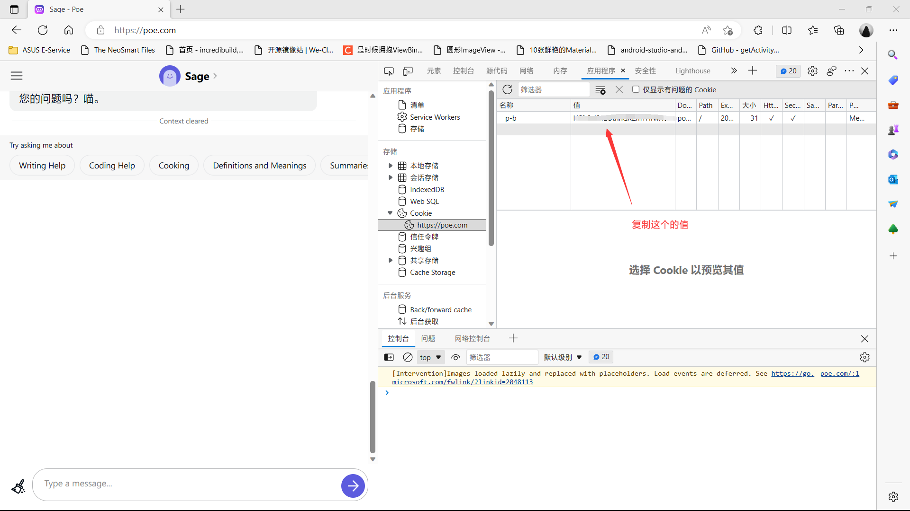

## koishi-plugin-chathub-poe-adapter

##  

> 为chathub提供poe.com支持的适配器

## 怎么使用？

1. 在插件市场安装本插件(`chathub-poe-adapter`)，并安装好本插件依赖的前置插件
2. 获取到poe账号的cookie里的`p-b`的值。这里介绍一下怎么用Chrome获取这个值

    1.登录到poe.com

    2.打开开发者工具，选择Application

    3.在左侧选择Cookie，找到poe.com的cookie，复制p-b的值

    如图所示：

    

3. 在插件的设置中填写你的p-b的值（请求设置 -> cookie）

4. 国内环境需要设置代理，推荐在`chathub`主插件里设置里设置代理(请求设置 -> isProxy，请求设置 -> proxyAddress)

5. 如果想默认使用poe的话，需要在插件的设置里设置为默认的适配器(全局设置 -> isDefault)，然后重启一次koishi

6. 现在你可以尝试回复Bot一句你好，如果Bot响应了你，那么恭喜你，你已经成功接入了poe。

## 常见问题

### 目前使用这个插件会对账号有风险吗？

在上游反编译API里，有人遇到了这样的[问题（账号被封）](https://github.com/ading2210/poe-api/issues/54)，我不能保证使用此插件后你的账号不会被封，请谨慎使用此插件。

### 什么是`注入Prompt` 和 `接受 System Prompt` ？

其实注入Prompt指的就是是否能类似OpenAI的适配器一样能注入信息，接受 System Prompt 是指是否能给poe里的bot设置人格设定。

需要注意的是这两个功能并不一定有效，建议谨慎使用。